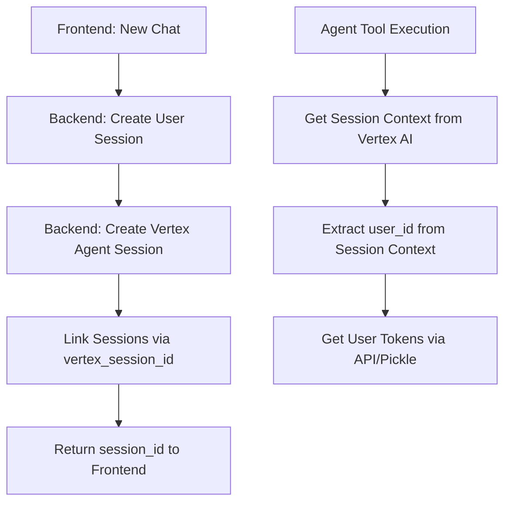

# 🚀 **Oprina Multi-User Deployment Guide**

## **📋 Overview**

This guide covers deploying Oprina's multi-user system with proper OAuth token management for Gmail and Calendar APIs.

## **🏗️ Architecture Overview**

### **Session Management Flow**


### **Key Components**
- **Backend**: Creates and manages user sessions + agent sessions
- **Agent**: Uses session context to get user_id for token access
- **Token Storage**: API-based (production) or pickle-based (development)

## **🔧 Current Implementation Status**

### **✅ Already Implemented**
- ✅ Backend agent integration (`VertexAgentClient`)
- ✅ Session linking (`vertex_session_id` in user sessions)
- ✅ Agent session management (`AgentSessionManager`)
- ✅ Multi-user token API endpoints (`/api/v1/internal/tokens`)
- ✅ Agent token client (`TokenClient`)
- ✅ Development/production mode detection

### **🎯 Key Insight: Session Context**
The agent tools get user context from **Vertex AI session context**, not from API lookups:

```python
# In agent tools
def get_gmail_messages(query: str):
    # Get user context from current session
    user_context = get_user_context_from_session()
    user_id = user_context['user_id']
    
    # Get tokens for this user
    tokens = get_user_tokens(user_id)
    # ... use tokens
```

## **📦 Deployment Phases**

### **Phase 1: Deploy Agent to Vertex AI**
```bash
cd oprina
python deployment/deploy.py
```

**Expected Output:**
```
✅ Agent deployed successfully
📋 Agent ID: projects/your-project/locations/us-central1/agents/oprina-agent-xxx
🔗 Copy this Agent ID for backend configuration
```

### **Phase 2: Configure Backend**
```bash
cd oprina-api

# Set environment variables
export VERTEX_AI_AGENT_ID="projects/your-project/locations/us-central1/agents/oprina-agent-xxx"
export GOOGLE_CLOUD_PROJECT="your-project-id"
export VERTEX_AI_LOCATION="us-central1"

# Install dependencies
pip install -r requirements.txt

# Run backend
python -m app.main
```

### **Phase 3: Test Session Creation**
```bash
# Test creating a new chat session
curl -X POST http://localhost:8000/api/v1/chat/sessions \
  -H "Authorization: Bearer YOUR_TOKEN" \
  -H "Content-Type: application/json" \
  -d '{"session_type": "chat"}'
```

**Expected Response:**
```json
{
  "session_id": "user-session-123",
  "user_id": "user-456",
  "agent_session_id": "vertex-session-789",
  "status": "active",
  "created_at": "2024-01-01T00:00:00Z"
}
```

### **Phase 4: Test Multi-User Token Access**

#### **Development Mode (Pickle Files)**
```bash
# Ensure pickle files exist in oprina/
ls oprina/gmail_auth/token.pickle
ls oprina/calendar_auth/token.pickle

# Test agent tool
curl -X POST http://localhost:8000/api/v1/chat/sessions/SESSION_ID/messages \
  -H "Authorization: Bearer YOUR_TOKEN" \
  -d '{"message": "Get my recent emails"}'
```

#### **Production Mode (API)**
```bash
# Test token API endpoint
curl -X GET http://localhost:8000/api/v1/internal/tokens/gmail/USER_ID \
  -H "X-Internal-API-Key: your-internal-key"

# Test agent with multiple users
# User 1
curl -X POST http://localhost:8000/api/v1/chat/sessions/SESSION_1/messages \
  -H "Authorization: Bearer USER_1_TOKEN" \
  -d '{"message": "Get my emails"}'

# User 2  
curl -X POST http://localhost:8000/api/v1/chat/sessions/SESSION_2/messages \
  -H "Authorization: Bearer USER_2_TOKEN" \
  -d '{"message": "Get my emails"}'
```

### **Phase 5: Production Deployment**

#### **Backend Deployment**
```bash
# Deploy to your cloud platform
# Example for Google Cloud Run:
gcloud run deploy oprina-backend \
  --source . \
  --platform managed \
  --region us-central1 \
  --set-env-vars VERTEX_AI_AGENT_ID=$VERTEX_AI_AGENT_ID
```

#### **Frontend Configuration**
```javascript
// Update frontend API base URL
const API_BASE_URL = 'https://your-backend-url.com/api/v1';

// Test new chat creation
const response = await fetch(`${API_BASE_URL}/chat/sessions`, {
  method: 'POST',
  headers: {
    'Authorization': `Bearer ${userToken}`,
    'Content-Type': 'application/json'
  },
  body: JSON.stringify({ session_type: 'chat' })
});
```

## **🔍 Troubleshooting**

### **Common Issues**

#### **1. Agent Tools Can't Get User Context**
```bash
# Check agent logs
gcloud logging read "resource.type=vertex_ai_agent" --limit=50

# Look for errors like:
# "No session context available"
# "No user_id in session context"
```

**Solution:** Ensure Vertex AI session context is properly configured in agent deployment.

#### **2. Token API Returns 404**
```bash
# Test internal API endpoint
curl -X GET http://localhost:8000/api/v1/internal/tokens/gmail/test-user \
  -H "X-Internal-API-Key: your-key"
```

**Solution:** Check that internal API endpoints are properly configured and user has tokens stored.

#### **3. Session Creation Fails**
```bash
# Check backend logs
tail -f logs/app.log

# Look for errors in:
# - ChatService.create_chat_session
# - AgentService.create_agent_session
# - VertexAgentClient.create_session
```

**Solution:** Verify Vertex AI agent is deployed and accessible.

## **📊 Monitoring & Scaling**

### **Key Metrics to Monitor**
- Session creation rate
- Agent response times
- Token API latency
- Error rates per user

### **Scaling Considerations**
- **Database**: User sessions and messages
- **Agent**: Vertex AI handles scaling automatically
- **Token Storage**: Consider Redis for high-traffic scenarios

## **🔐 Security Checklist**

- [ ] Internal API endpoints secured with API keys
- [ ] User tokens encrypted at rest
- [ ] Session validation on all requests
- [ ] Rate limiting on token API endpoints
- [ ] Audit logging for token access

## **✅ Success Criteria**

Your deployment is successful when:

1. **✅ Multiple users can create separate chat sessions**
2. **✅ Each user's agent tools access only their tokens**
3. **✅ Sessions are properly linked (user ↔ vertex)**
4. **✅ Development mode works with pickle files**
5. **✅ Production mode works with API token access**

## **🎯 Next Steps**

After successful deployment:

1. **Monitor Usage**: Set up logging and metrics
2. **Scale Testing**: Test with multiple concurrent users
3. **Token Refresh**: Implement automatic OAuth token refresh
4. **Backup Strategy**: Plan for session and token data backup
5. **Performance Optimization**: Optimize token API response times

---

**🎉 Congratulations!** Your multi-user Oprina system is now deployed and ready to scale from 1 to 1000+ users! 