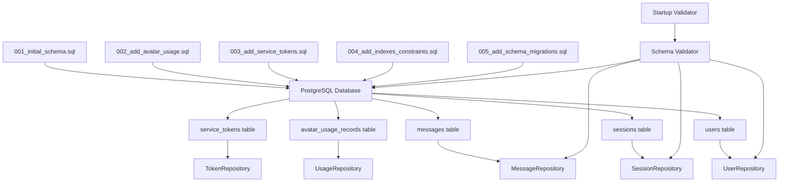

# 🔗 Migration Files ↔ Repository Connection Guide

## Overview

You asked: **"We are not importing any migration files in repositories?"**

You're absolutely right! This document explains exactly how **SQL migration files** connect to **Python repository classes** in the Oprina project.

## 🎯 The Key Understanding

**Migration files and repositories don't import each other directly.** Instead, they work together through the **database schema** as the bridge:

```
Migration Files (SQL) → Database Schema → Repository Classes (Python)
```

## 🔄 Complete Flow Diagram



## 📋 Step-by-Step Connection

### 1. **Migration Creates Schema**
```sql
-- From migrations/001_initial_schema.sql
CREATE TABLE users (
    id UUID PRIMARY KEY DEFAULT uuid_generate_v4(),
    email VARCHAR(255) UNIQUE NOT NULL,
    display_name VARCHAR(255),
    preferences JSONB DEFAULT '{}',
    -- ... other columns
);

CREATE TABLE sessions (
    id UUID PRIMARY KEY DEFAULT uuid_generate_v4(),
    user_id UUID NOT NULL REFERENCES users(id),
    session_token VARCHAR(255) UNIQUE NOT NULL,
    -- ... other columns
);
```

### 2. **Repository Uses Schema**
```python
# From oprina-api/app/core/database/repositories/user_repository.py
from app.core.database.schema_validator import TableNames

class UserRepository:
    def __init__(self, db_client: Client):
        self.db = db_client
        self.table_name = TableNames.USERS  # "users" - matches migration!
    
    async def create_user(self, user_data: Dict[str, Any]) -> Dict[str, Any]:
        # This works because migration created the "users" table
        response = self.db.table(self.table_name).insert(user_data).execute()
        return response.data[0]
```

### 3. **Schema Validator Ensures Alignment**
```python
# From oprina-api/app/core/database/schema_validator.py
class SchemaValidator:
    EXPECTED_TABLES = {
        "users": {"required_columns": {"id", "email", "display_name", ...}},
        "sessions": {"required_columns": {"id", "user_id", "session_token", ...}}
    }
    
    REPOSITORY_TABLE_MAPPINGS = {
        "UserRepository": "users",      # ✅ Must match migration table name
        "SessionRepository": "sessions", # ✅ Fixed from "user_sessions"
    }
```

### 4. **Centralized Table Names**
```python
# From oprina-api/app/core/database/schema_validator.py
class TableNames:
    """Centralized table name constants - prevents hardcoding"""
    USERS = "users"                    # Matches migration table name
    SESSIONS = "sessions"              # Matches migration table name
    MESSAGES = "messages"              # Matches migration table name
    SERVICE_TOKENS = "service_tokens"  # Matches migration table name
    AVATAR_USAGE_RECORDS = "avatar_usage_records"  # Matches migration table name
```

## 🔧 What We Fixed

### **❌ Before (Broken Connection):**
```python
class SessionRepository:
    def __init__(self, db_client: Client):
        self.table_name = "user_sessions"  # ❌ Table doesn't exist!
```

### **✅ After (Fixed Connection):**
```python
class SessionRepository:
    def __init__(self, db_client: Client):
        self.table_name = TableNames.SESSIONS  # ✅ "sessions" - matches migration!
```

## 🚀 Real-World Usage Example

### **1. Migration runs first:**
```bash
psql -d oprina_db -f migrations/001_initial_schema.sql
# Creates: users, sessions, messages tables
```

### **2. Application validates schema:**
```python
validation_results = await run_startup_validation(db_client)
if not validation_results["startup_successful"]:
    print("❌ Missing tables - run migrations first!")
```

### **3. Repository operates:**
```python
user_repo = UserRepository(db_client)
user = await user_repo.create_user({"email": "user@example.com"})
# Works because migration created "users" table
```

## 🎯 Key Takeaways

### **The Connection Points:**
1. **Migration files** define database structure (SQL DDL)
2. **Repository classes** expect that structure to exist (Python code)
3. **Schema validator** ensures they stay aligned
4. **Table name constants** prevent hardcoding mismatches
5. **Startup validation** catches issues early

### **Why This Approach Works:**
- ✅ **Separation of concerns**: SQL handles schema, Python handles logic
- ✅ **Type safety**: Centralized table names prevent typos
- ✅ **Validation**: Automatic checks ensure alignment
- ✅ **Error prevention**: Startup validation catches issues before production

## 🎉 Summary

**Migration files don't need to be imported by repositories** because they work through the database schema as an intermediary. The migration files create the database structure, and the repository classes use that structure through the database connection.

The key innovation is the **validation layer** that ensures these two sides stay in sync, preventing repositories from expecting tables or columns that don't exist.

## 🔧 Running the Complete System

### **1. Apply Migrations:**
```bash
# Run in order
psql -d your_db -f migrations/001_initial_schema.sql
psql -d your_db -f migrations/002_add_avatar_usage.sql
psql -d your_db -f migrations/003_add_service_tokens.sql
psql -d your_db -f migrations/004_add_indexes_constraints.sql
psql -d your_db -f migrations/005_add_schema_migrations.sql
```

### **2. Start Application:**
```python
# Application automatically validates schema on startup
python -m oprina-api.example_usage
```

### **3. Use Repositories:**
```python
# Repositories now work correctly with migration-created tables
user_repo = UserRepository(db_client)
session_repo = SessionRepository(db_client)
# All operations work because schema matches expectations
```

## 🎉 Summary

**Migration files don't need to be imported by repositories** because they work through the database schema as an intermediary. The migration files create the database structure, and the repository classes use that structure through the database connection.

The key innovation in our system is the **validation layer** that ensures these two sides stay in sync, preventing the common issue of repositories expecting tables or columns that don't exist.

This approach provides the best of both worlds:
- **SQL migrations** handle complex database operations efficiently
- **Python repositories** provide clean, type-safe data access
- **Validation system** ensures they work together correctly
- **Centralized constants** prevent configuration drift 