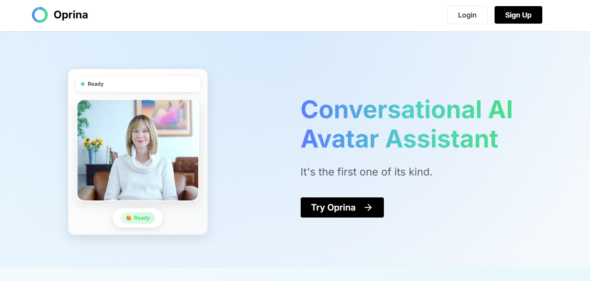
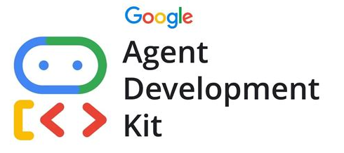

# Oprina: Conversational AI Avatar Assistant

(It's the first one of its kind)

## Overview

Oprina is a revolutionary voice-powered AI assistant that combines conversational intelligence with interactive avatar technology. Through natural voice commands and real-time avatar interactions, Oprina transforms how you manage your digital life—making email management, calendar scheduling, and productivity tasks as simple as having a conversation with a trusted assistant.

Oprina's comprehensive platform features HeyGen streaming avatars for lifelike interactions, seamless Gmail and Google Calendar integration, intelligent voice processing with speech-to-text and text-to-speech capabilities, Google ADK-powered multi-agent architecture with specialized email and calendar agents, and enterprise-grade user authentication and session management. These technologies work together to create an immersive, voice-first experience that makes AI assistance feel natural and intuitive!

<table border="0">
<tr>
<td>

</td>
<td style="vertical-align: middle; padding-left: 20px;">
<h2><strong>Built for the Agent Development Kit Hackathon with Google Cloud</strong></h2>
</td>
</tr>
</table>

***

## See it in action

Go to https://www.oprinaai.com to see Oprina live.

## Table of Contents

- [Oprina Architecture](#oprina-architecture)
  - [Backend API](#backend-api)
  - [Frontend](#frontend)
  - [Oprina Agent](#oprina-agent)
  - [Vertex Deployment](#vertex-deployment)
  - [Supabase Database](#supabase-database)
- [Run Locally / Self-Hosting](#run-locally--self-hosting)
- [Acknowledgements](#acknowledgements)
- [License](#license)

## Oprina Architecture

Oprina consists of five main components working together to deliver a seamless conversational AI experience:

### Backend API
FastAPI-based service that handles REST endpoints, user authentication, avatar session management, and integration with external services like Google Cloud AI and HeyGen APIs.

### Frontend
React/TypeScript application providing a responsive web interface with real-time avatar streaming, voice controls, chat interface, user settings, and dashboard functionality.

### Oprina Agent
AI-powered agent system built on Google's Agent Development Kit (ADK) featuring multimodal Gemini 2.0 Flash model, specialized email and calendar sub-agents, voice-optimized conversation flows, and comprehensive tool integration for Gmail and Google Calendar operations.

### Vertex Deployment
Google Cloud Vertex AI deployment infrastructure for scalable agent hosting, session management, and production-ready AI model serving with enterprise-grade security and performance.

### Supabase Database
PostgreSQL database with real-time capabilities handling user management, conversation history, session state, avatar usage tracking, contact form submissions, and authentication workflows.

## Run Locally / Self-Hosting

Oprina can be self-hosted on your own infrastructure for complete control and privacy. We provide comprehensive guides for different deployment scenarios:

📖 **[Local Development Setup](docs/local-setup.md)** - Complete guide for running Oprina locally with all components

🚀 **[Self-Hosting Guide](docs/self-hosting.md)** - Production deployment instructions for your own servers

Both guides include:
- Prerequisites and requirements
- Step-by-step installation instructions
- Environment configuration
- Troubleshooting tips
- Security considerations

## Acknowledgements

### Contributors

<table>
<tr>
    <td align="center">
        <a href="https://github.com/rohith4444">
            
             
            <b>Rohith Reddy Mandala</b>
        </a>
         
        Project Creator & Lead Developer
    </td>
    <td align="center">
        <a href="https://github.com/calvinhoang203">
            
             
            <b>Hieu Hoang (Calvin)</b>
        </a>
         
        Developer
    </td>
    <td align="center">
        <a href="https://github.com/abharathkumarr">
            
             
            <b>Bharath Kumar</b>
        </a>
         
        Developer
    </td>
</tr>
</table>

### Technologies
- [Google Cloud AI Platform](https://cloud.google.com/ai-platform) - AI model hosting and Vertex AI
- [Google ADK](https://cloud.google.com/agent-development-kit) - Agent development framework
- [HeyGen](https://heygen.com/) - AI avatar generation and streaming
- [Supabase](https://supabase.com/) - Database, authentication, and real-time features
- [React](https://reactjs.org/) - Frontend framework
- [FastAPI](https://fastapi.tiangolo.com/) - Backend API framework
- [Tailwind CSS](https://tailwindcss.com/) - UI styling
- [TypeScript](https://www.typescriptlang.org/) - Type-safe development

## License

Oprina is licensed under the Apache License, Version 2.0. See [LICENSE](./LICENSE) for the full license text.
